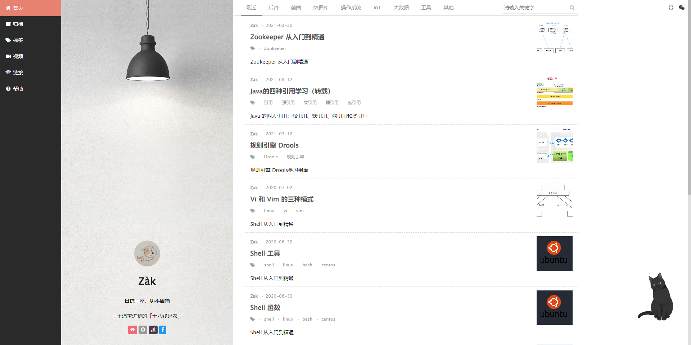

# 个人博客

### 一、简介

这是个人学习博客的项目，主要记录个人工作学习过程中积累的经验，也偶尔转载被人的文章，仅供学习，请勿较真。

### 二、使用说明


#### 2.1 Hexo

本项目采用Hexo构建，Hexo的使用请访问 https://hexo.io/zh-cn/


#### 2.2 博客编写

本项目博客采用MarkDown语法编写，Markdown编写语法请自行查找。


#### 2.3 编写模板

```
---
title: 文章标题

date: 文章发表日期

author: 作者

avatar: 图像

authorLink: 作者的个人主页

authorAbout: 关于作者

authorDesc: 简介

categories: 分类

tags:
	- 标签

	- 标签

	- 标签

keywords: 搜索关键字

photos:
	- 文章主图

description: 文章内容描述
---

......
正文
......

```

#### 2.4 预览文章

执行以下命令即可在本地预览文章，打开 http://localhost:4000/blog/ 即可查看博客内容。

```
$ hexo server
INFO  Validating config
WARN  Deprecated config detected: "external_link" with a Boolean value is deprecated. See https://hexo.io/docs/configuration for more details.
INFO  Start processing
INFO  Hexo is running at http://localhost:4000/blog/ . Press Ctrl+C to stop.
```




#### 2.5 发布文章

執行一下命令即可发布文章到Github.

```
hexo deploy 
```

#### 2.6 主题模板

开源的主题模板很多，我这里采用的是 https://github.com/tangkunyin/hexo-theme-jsimple。


### 三、配置説明

```yaml
# Hexo Configuration
## Docs: http://hexo.io/docs/configuration.html
## Source: https://github.com/hexojs/hexo/

# Site
title: Table页面标题
subtitle: 子标题
keywords: 关键字
description: 描述
author: 作者
language:
- zh-cn
- en

timezone: Asia/Shanghai

# URL
## If your site is put in a subdirectory, set url as 'http://yoursite.com/child' and root as '/child/'
url: 
root: /blog/
permalink: :year/:month/:day/:title.html
permalink_defaults:
  lang: en

# Directory
source_dir: source
public_dir: public
tag_dir: tags
archive_dir: archives
category_dir: categories
code_dir: downloads/code
i18n_dir: :lang
skip_render:
  - README.md
  - README.zhCN.md

# Writing
new_post_name: :title.md # File name of new posts
default_layout: post
titlecase: true # Transform title into titlecase
external_link: false # Open external links in new tab
filename_case: 0s
render_drafts: false
post_asset_folder: false
relative_link: false
future: true
highlight:
  enable: true
  line_number: false
  auto_detect: true
  tab_replace:

# Category & Tag
default_category: 后台
category_map:
   后台: server
   前端: front
   数据库: db
   操作系统: os
   IoT: iot
   大数据: bigdata
   工具: tools
   其他: others
tag_map:
  iOS: iOS
  hexo: hexo
  swift: swift
  golang: golang
  sketch: sketch
  zeplin: zeplin
  网站: website
  后台: serverSide
  JS大法: javascript
  ReactNative: RN
  Mac必备工具: MacTools
  跨平台: CrossPlatform


# Date / Time format
## Hexo uses Moment.js to parse and display date
## You can customize the date format as defined in
## http://momentjs.com/docs/#/displaying/format/
date_format: YYYY-MM-DD
time_format: HH:mm:ss

# Pagination
## Set per_page to 0 to disable pagination
per_page: 10
pagination_dir: page

# Extensions
## Plugins: http://hexo.io/plugins/
## Themes: http://hexo.io/themes/


theme: jsimple
#theme: hexo-theme-hipaper

fullHttps: false

# Deployment
## Docs: http://hexo.io/docs/deployment.html

deploy:
- type: git
  repo: https://github.com/wuzguo/blog.git
  branch: gh-pages

# Backup settings see:https://github.com/coneycode/hexo-git-backup
backup:
  type: git
  message: 博客文章备份
  repository:
    github: https://github.com/wuzguo/blog.git


# ------------- Third part private config in theme ----------------------
# comment ShortName, you can choose only ONE to display.
disqus_shortname: wuzguo

# CNZZ count
cnzz_siteid: 
```


### 四、云养猫

本人主页的猫咪是采用的开源项目采用Live2D技术实现的，请访问 https://github.com/EYHN/hexo-helper-live2d。具体配置如下：

```
# Live2D
## https://github.com/EYHN/hexo-helper-live2d
## https://l2dwidget.js.org/docs/class/src/index.js~L2Dwidget.html#instance-method-init
live2d:
  enable: true
  #enable: false
  scriptFrom: local # 默认
  pluginRootPath: live2dw/ # 插件在站点上的根目录(相对路径)
  pluginJsPath: lib/ # 脚本文件相对与插件根目录路径
  pluginModelPath: assets/ # 模型文件相对与插件根目录路径
  # scriptFrom: jsdelivr # jsdelivr CDN
  # scriptFrom: unpkg # unpkg CDN
  # scriptFrom: https://cdn.jsdelivr.net/npm/live2d-widget@3.x/lib/L2Dwidget.min.js # 你的自定义 url
  tagMode: false # 标签模式, 是否仅替换 live2d tag标签而非插入到所有页面中
  debug: false # 调试, 是否在控制台输出日志
  model:
    use: live2d-widget-model-hijiki
    # use: live2d-widget-model-wanko # npm-module package name
    # use: wanko # 博客根目录/live2d_models/ 下的目录名
    # use: ./wives/wanko # 相对于博客根目录的路径
    # use: https://cdn.jsdelivr.net/npm/live2d-widget-model-wanko@1.0.5/assets/wanko.model.json # 你的自定义 url
  display:
    position: right
    width: 145
    height: 315
  mobile:
    show: true # 是否在移动设备上显示
    scale: 0.5 # 移动设备上的缩放
  react:
    opacityDefault: 0.7
    opacityOnHover: 0.8
```


### 五、持续更新...

根据学习进度，持续更新....

### 六、纠错
欢迎大家指出不足，如有任何疑问，请邮件联系 wuzguo@gmail.com 或者直接修复并提交 Pull Request。
